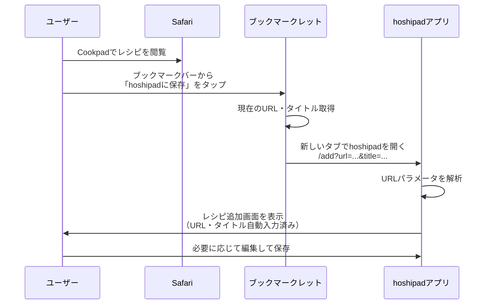

# Webブックマークレット実装 - Walkthrough

## 概要

WebアプリでもSafariからレシピURLを共有できるようにするため、ブックマークレット方式を実装しました。

SafariはWeb Share Target APIに対応していないため、ブックマークレットを使用してレシピ保存機能を提供します。

## 実装内容

### ✅ Flutter側の実装

#### 1. URLパラメータでタイトルも受け取る機能を追加

[add_recipe_screen.dart](file:///Users/bacchus/dev/sin1kbk/hoshipad/flutter_app/lib/screens/add_recipe_screen.dart)に`prefilledTitle`パラメータを追加：

```dart
class AddRecipeScreen extends StatefulWidget {
  final Recipe? recipe;
  final String? sharedUrl;
  final String? prefilledTitle;  // 追加

  const AddRecipeScreen({
    super.key,
    this.recipe,
    this.sharedUrl,
    this.prefilledTitle,  // 追加
  });
}
```

initStateで自動入力：

```dart
@override
void initState() {
  super.initState();

  // 共有されたURLがある場合は自動設定
  if (widget.sharedUrl != null) {
    _urlController.text = widget.sharedUrl!;
  }

  // 事前入力されたタイトルがある場合は自動設定
  if (widget.prefilledTitle != null && widget.prefilledTitle!.isNotEmpty) {
    _titleController.text = widget.prefilledTitle!;
  }
  // ...
}
```

#### 2. GoRouterの更新

[main.dart](file:///Users/bacchus/dev/sin1kbk/hoshipad/flutter_app/lib/main.dart)の`/add`ルートで`title`クエリパラメータを受け取る：

```dart
GoRoute(
  path: '/add',
  parentNavigatorKey: rootNavigatorKey,
  builder: (context, state) {
    final sharedUrl = state.uri.queryParameters['url'];
    final sharedTitle = state.uri.queryParameters['title'];
    return AddRecipeScreen(
      sharedUrl: sharedUrl,
      prefilledTitle: sharedTitle,
    );
  },
),
```

これにより、以下のようなURLでアクセスすると自動入力されます：

```
https://yourhoshipad.com/add?url=https://cookpad.com/recipe/123&title=美味しい肉じゃが
```

---

### ✅ ブックマークレットページの作成

[bookmarklet.html](file:///Users/bacchus/dev/sin1kbk/hoshipad/flutter_app/web/bookmarklet.html)を作成しました。

このページには以下の内容が含まれます：

1. **ブックマークレットボタン**
   - ユーザーがブックマークバーにドラッグ&ドロップまたは長押しで追加できる

2. **インストール手順**
   - iOS Safari用とデスクトップSafari/Chrome用の詳細な手順

3. **使い方ガイド**
   - ブックマークレットの使用方法を分かりやすく説明

4. **技術的な説明**
   - URLパラメータの仕組みを具体例で説明

#### ブックマークレットのコード

```javascript
javascript:(function(){
  const url = window.location.href;
  const title = document.title;
  window.open(
    'https://yourhoshipad.com/add?url=' +
    encodeURIComponent(url) +
    '&title=' +
    encodeURIComponent(title),
    '_blank'
  );
})();
```

> [!IMPORTANT]
> **カスタマイズが必要**: `https://yourhoshipad.com`を実際のhoshipadのURL（本番環境またはローカルホスト）に置き換えてください。

---

## 使用フロー



---

## 動作確認

### ローカルでの確認方法

1. **Flutter Webアプリを起動**

```bash
cd /Users/bacchus/dev/sin1kbk/hoshipad/flutter_app
flutter run -d chrome --web-port=8080
```

2. **ブックマークレットのカスタマイズ**

[bookmarklet.html](file:///Users/bacchus/dev/sin1kbk/hoshipad/flutter_app/web/bookmarklet.html)を編集：

```html
<!-- 変更前 -->
<a href="javascript:(function(){...window.open('https://yourhoshipad.com/add?url='...

<!-- 変更後（ローカルテスト用） -->
<a href="javascript:(function(){...window.open('http://localhost:8080/add?url='...
```

3. **ブックマークレットページを開く**

ブラウザで以下を開く：
```
file:///Users/bacchus/dev/sin1kbk/hoshipad/flutter_app/web/bookmarklet.html
```

4. **ブックマークレットをインストール**

ページの指示に従ってブックマークバーに追加

5. **テスト**

Cookpadなどのレシピページでブックマークレットをクリック

---

## デプロイ時の注意事項

### 本番環境用のブックマークレット設定

1. **bookmarklet.htmlの更新**

本番URLに変更：

```javascript
window.open('https://hoshipad.youromain.com/add?url=' + ...
```

2. **manifest.jsonの更新**

[manifest.json](file:///Users/bacchus/dev/sin1kbk/hoshipad/flutter_app/web/manifest.json)でアプリ名などを設定：

```json
{
  "name": "hoshipad",
  "short_name": "hoshipad",
  "description": "レシピをかんたん保存・管理",
  "start_url": "/",
  "display": "standalone",
  ...
}
```

3. **ブックマークレットページの公開**

- Webアプリと一緒にデプロイ
- または専用のヘルプページとして公開
- アプリ内からリンク（例: 設定画面 > ヘルプ > Webブラウザから保存）

---

## ユーザー向けドキュメント

ユーザーがブックマークレットを簡単にインストールできるよう、アプリ内にヘルプページへのリンクを追加することを推奨します。

### オプション: アプリ内ヘルプページへのリンク追加

設定画面やメニューに以下のようなリンクを追加：

```dart
ListTile(
  leading: Icon(Icons.bookmark),
  title: Text('Webブラウザから保存'),
  subtitle: Text('ブックマークレットをインストール'),
  onTap: () async {
    final url = Uri.parse('https://hoshipad.yourdomain.com/bookmarklet.html');
    if (await canLaunchUrl(url)) {
      await launchUrl(url);
    }
  },
),
```

---

## 今後の拡張案

1. **Chrome Extension**
   - Chromeユーザー向けに拡張機能を開発
   - 右クリックメニューから保存可能に

2. **PWAとしての改善**
   - Service Workerの追加
   - オフライン対応
   - ホーム画面に追加でアプリライクな体験

3. **メタデータ自動取得の強化**
   - Open Graphタグから画像URLを自動取得
   - レシピの材料や手順も可能な限り自動取得

---

## まとめ

✅ **Web版での共有機能が完成しました！**

- URLとタイトルのパラメータ受け取り機能を実装
- ブックマークレット用の美しいインストールページを作成
- iOS SafariとデスクトップSafari/Chromeの両方に対応

**次のステップ:**
1. `bookmarklet.html`内のURLを本番環境のURLに変更
2. ブックマークレットページをテスト
3. ユーザー向けドキュメントをアプリ内に追加（オプション）

ご質問やフィードバックがあれば、お気軽にお知らせください！
